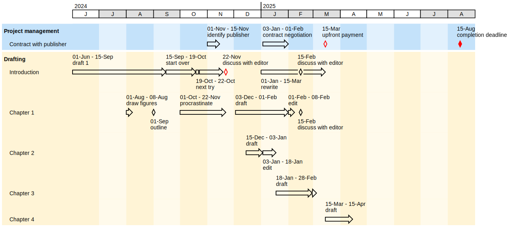

# timeline

A package to create timeline visualizations

The imput is a simple text file. Its format follows a basic domain-specific language:

* `SECTION xxx` starts a section with the caption 'xxx'

* `THREAD xxx` starts a thread within a section. The thread's caption is 'xxx'

* Within a thread, time points can be added, following the syntax:
`xxx: dd-mm-yy` where 'xxx' is the caption and 'dd-mm-yy' is the date in the specified format.

* time intervals can be added following the syntax:
`xxx: dd-mm-yy - dd-mm-yy` where 'xxx' is the interval's caption, and the dates to either side of the dash are the start and the end dates.

The output is a svg file with the same name as the input file.

That's it. Have fun!



## Installation

```bash
$ pip install timeline
```

## Usage

```bash
timeline infile.tl
```

There are the following options to the `timeline` command:

* `-t` or `--today` ads a marker line with the current date
* `-i` or `--min-date` sets the left border of the timeline chart, the data must be provided as `dd-mm-yyyy`
* `-x` or `--max-date` sets the right border of the timeline chart, the data must be provided as `dd-mm-yyyy`
* `-w` or `--show-date` is actually a misnomer. This option hides the date in the output. Sorry for that.
* `-o` or `--outfile` lets you specify a different filename for the output.
* `-v` or `--version` displays the version of `timeline` and exits.


## License

`timeline` was created by Rainer Strotmann. It is licensed under the terms of the MIT license.

## Credits

`timeline` was created with [`cookiecutter`](https://cookiecutter.readthedocs.io/en/latest/) and the `py-pkgs-cookiecutter` [template](https://github.com/py-pkgs/py-pkgs-cookiecutter).
